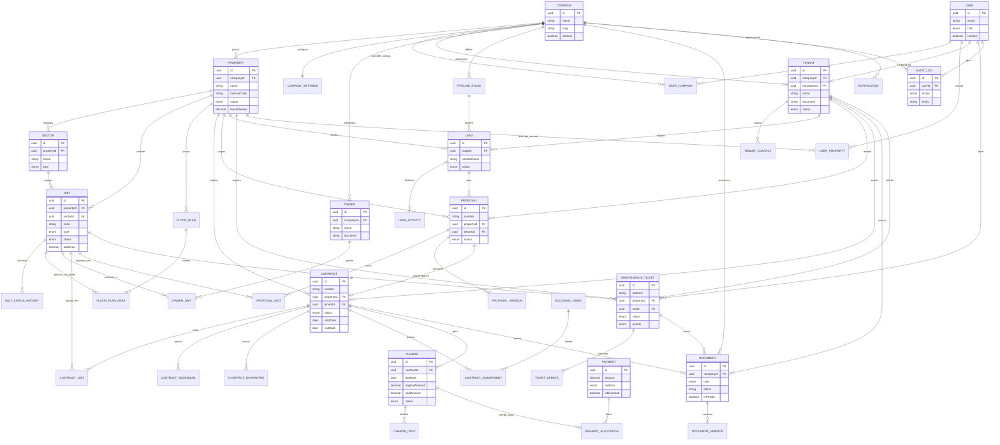

# Modelo de dados — PátioGestor

Diagrama de entidade-relacionamento (Mermaid) com as principais entidades e
relacionamentos. O esquema completo, com todos os campos, está em
[`prisma/schema.prisma`](../prisma/schema.prisma); os nomes de tabela no
banco (via `@@map`) usam `snake_case`.

## Observações de modelagem

- **UUIDs** em todas as chaves primárias.
- **Exclusão lógica** (`deletedAt`) em `properties`, `units`, `sectors`,
  `tenants`, `owners`, `contracts` e `documents` — nunca removidos
  fisicamente, conforme a regra de negócio de preservar histórico.
- **Valores monetários** sempre `Decimal` (nunca `Float`), mapeados para
  `NUMERIC` no PostgreSQL.
- **Histórico obrigatório**: `unit_status_history`, `contract_adjustments`,
  `ticket_updates`, `payment_allocations` e `audit_logs` nunca são
  sobrescritos — cada mudança gera uma nova linha.
- **Isolamento multiempresa**: praticamente toda tabela de negócio encadeia
  até `companies` (diretamente ou via `properties`/`tenants`), permitindo
  filtrar por empresa em uma única condição de `JOIN`.
